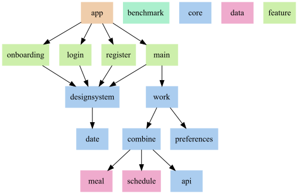

# 시각장애인 학생들을 위한 학사정보 앱

전국 맹학교의 급식, 학사일정 등 학사일정 정보를 제공하는 앱입니다. 한소네를 포함한 모든 안드로이드 기기에서 사용할 수 있습니다.

## 다운로드

## 주요 기능
* **모든 기능에 시각장애인 접근성 고려 (저시력, 전맹 포함)**
* 식단 및 학사일정 정보 제공
* 학사정보 검색 (예정)
* 당일 식단 및 일정 알림 (예정)

## 지원 학교
* 한빛맹학교
* 지원 학교는 계속 확대될 예정입니다.

## 스크린샷

## Navigation Flow

## 기술 스택
* [Jetpack Compose](https://developer.android.com/jetpack/compose)
* [Firebase](https://firebase.google.com/?hl=ko)
* [Android Architecture Components](https://developer.android.com/topic/libraries/architecture?hl=ko) (Room, ViewModel, WorkManager 등)
* [Retrofit](https://github.com/square/retrofit), [Gson](https://github.com/google/gson)
* [KoreanLunarCalendar](https://github.com/usingsky/KoreanLunarCalendar)

## 아키텍처
[Android Architecture Guideline](https://developer.android.com/topic/architecture)을 준수했습니다.

## 모듈 구조
[Now in Android의 모듈 구조](https://github.com/android/nowinandroid/blob/main/docs/ModularizationLearningJourney.md)를 참고하여 구성했습니다.

## 연락처
버그 제보 및 기능 개선 등 건의사항은 [이메일](mailto:blinder.contact@gmail.com)로 보내주세요.
