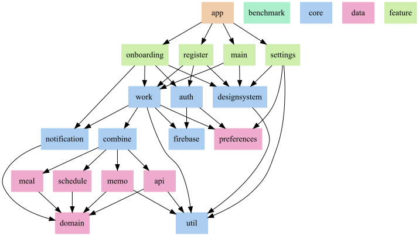

# 블린더 안드로이드 앱

## Navigation Flow

## 기술 스택
* [Jetpack Compose](https://developer.android.com/jetpack/compose)
* [Firebase](https://firebase.google.com/?hl=ko)
* [Android Architecture Components](https://developer.android.com/topic/libraries/architecture?hl=ko) (Room, ViewModel, WorkManager 등)
* [Retrofit](https://github.com/square/retrofit), [Gson](https://github.com/google/gson)
* [KoreanLunarCalendar](https://github.com/usingsky/KoreanLunarCalendar)

## 아키텍처
[Android Architecture Guideline](https://developer.android.com/topic/architecture)을 준수했습니다.

## 모듈 구조
[Now in Android의 모듈 구조](https://github.com/android/nowinandroid/blob/main/docs/ModularizationLearningJourney.md)를 참고하여 구성했습니다.

## 스크린샷

